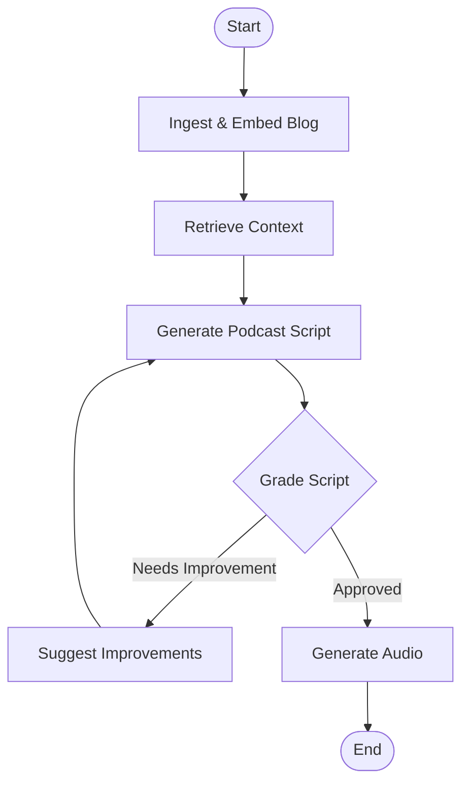

# 🎙️ Blog-to-Podcast Agent


**Blog-to-Podcast Agent** is an intelligent workflow that converts technical blog posts into engaging audio podcasts. 

This project uses an **agentic workflow (LangGraph)** to ingest content, generate a conversational script, grade the quality of the script, and iteratively improve it before generating the final audio using **ElevenLabs**.

---
## 🎯 Why This Project?

This project demonstrates how to build **production-grade agentic AI systems**, not just prompt-based demos.

Key engineering goals:
- Deterministic control over LLM behavior
- Quality-gated content generation
- Safe, cost-controlled iteration loops
- Clear separation of ingestion, reasoning, and execution

The design mirrors real-world agent architectures used in enterprise GenAI systems.

## 🧩 Agent Design Patterns

This project intentionally applies multiple modern agent patterns:

- **Cyclic Agent Workflow** — Supports iterative improvement with bounded retries
- **Reflection Pattern** — LLM critiques its own outputs and regenerates
- **RAG (Retrieval-Augmented Generation)** — Grounded script generation
- **Quality Gatekeeping** — Structured graders prevent low-quality outputs
- **State-Driven Orchestration** — Explicit state transitions via LangGraph

## 🏗️ Agent Architecture

This project uses a cyclic graph to ensure high-quality script generation.


## ✨ Key Features
🕷️ Smart Ingestion: Uses TavilyCrawl to extract clean, relevant content from blog URLs, filtering out noise.

🧠 Local RAG: Employs Ollama (nomic-embed-text) and ChromaDB for secure, local vector storage and retrieval.

🔄 Iterative Scripting: A dedicated grade_script node evaluates the draft and triggers suggest_improvements if the quality threshold isn't met.

🗣️ Premium Audio: Integrates with ElevenLabs using the eleven_multilingual_v2 model for human-like voice synthesis.

## 🛠️ Tech Stack
Orchestration: LangGraph & LangChain

Embeddings: Ollama (nomic-embed-text)

Vector Database: ChromaDB

Web Intelligence: Tavily API

Audio Synthesis: ElevenLabs API

Dependency Management: Poetry

## 🚀 Installation & Setup
1. Prerequisites
Ensure you have Python 3.11+ and Ollama installed locally.
```python
Bash

# Pull the required embedding model
ollama pull nomic-embed-text
```
2. Clone and Install
```
Bash

git clone [https://github.com/dR-ViBE/Blog-to-Podcast-Agent.git](https://github.com/dR-ViBE/Blog-to-Podcast-Agent.git)
cd Blog-to-Podcast-Agent/Podcast_Agent
pip install poetry
poetry install
```
3. Environment Configuration
Create a .env file in the Podcast_Agent/ directory and add your keys:
```
Ini, TOML

GROQ_API_KEY=your_groq_api_key
TAVILY_API_KEY=your_tavily_api_key
ELEVENLABS_API_KEY=your_elevenlabs_api_key
```
💻 Usage
Step 1: Ingest Content
Set the target URL in ingestion.py and run it to populate your local vector store:
```
Bash

poetry run python ingestion.py
```
Step 2: Run the Agent
Execute the main graph to generate your podcast script and audio file:
```
Bash

poetry run python main.py
```
Generated files are saved to: Podcast_Agent/outputs/audio/.

📂 Project Structure
```text

Podcast_Agent/
├── .chroma/                 # Local Vector Database
├── outputs/audio/           # Synthesized podcast files
├── graph/
│   ├── chains/              # Logic for script writing and grading
│   ├── nodes/               # Individual agent tasks
│   └── graph.py             # LangGraph state machine definition
├── ingestion.py             # Data crawling and embedding logic
├── main.py                  # Entry point to trigger the workflow
└── pyproject.toml           # Dependency and project metadata
```
## 🚧 Future Enhancements

- Human-in-the-Loop approval before audio generation
- Persistent reflection memory across runs
- Multi-blog batch processing
- Speaker diarization and multi-voice podcasts
- UI layer (Streamlit / Next.js)
- Cost-aware routing across multiple LLM providers
